ioc：

读取配置文件application.xml，将文件中的内容解析为一个dom树，之后把从根节点开始解析构造beandefitionholder对象，存储在beandefitionmap,key是beanfition,解决依赖，设置属性。


# SpringBoot

## idea创建项目

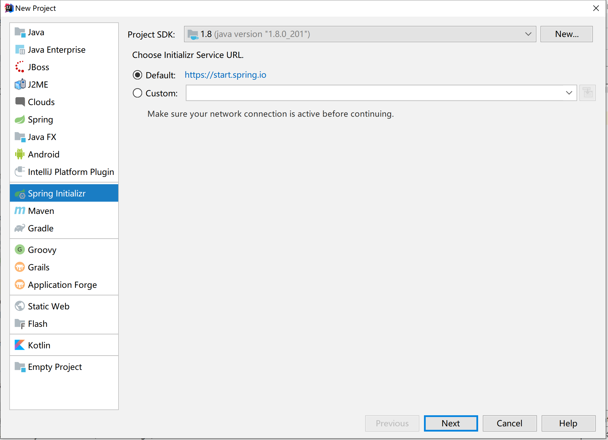


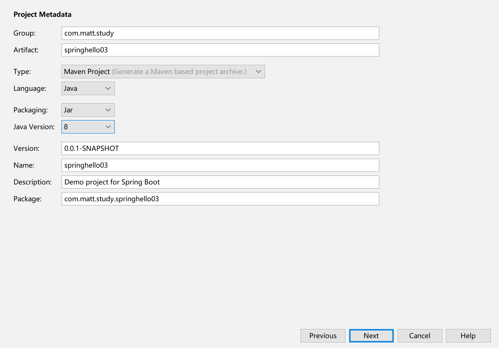


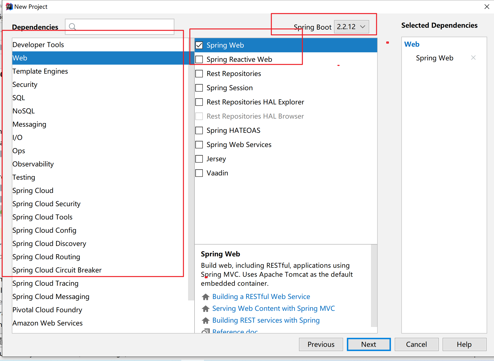


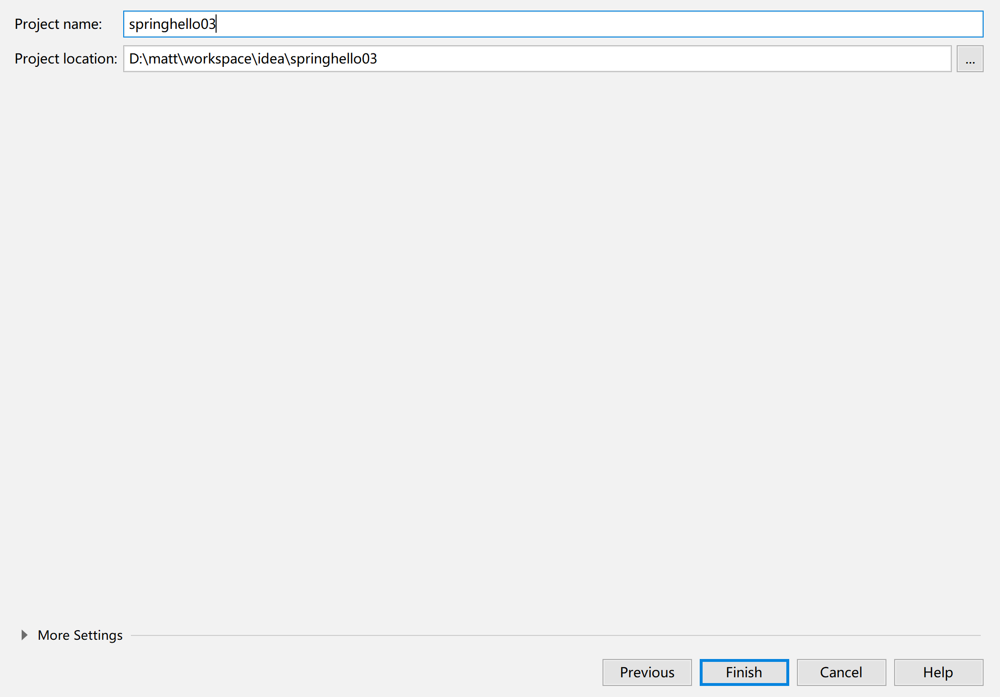


基本就是next即可。


## 配置文件

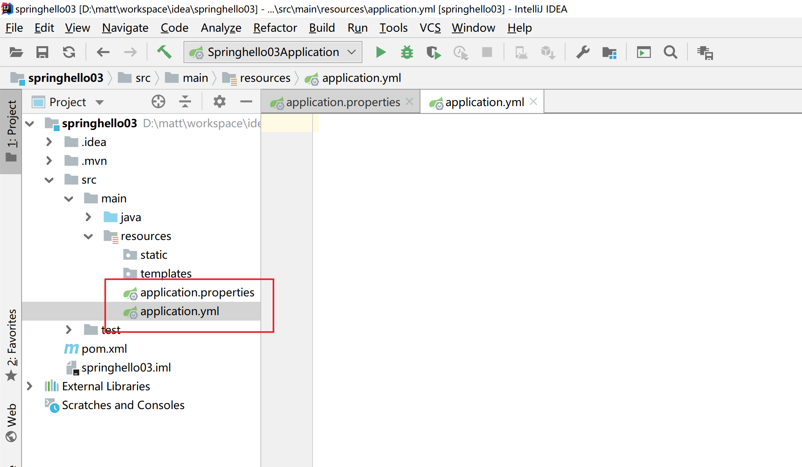


### yml语法

可以写三种类型基本值、对象和数组

**基本属性**

```yml
server:
  port: 9000


person:
  name: matt
  age: 17
```

""：双引号；不会转义字符串里面的特殊字符；特殊字符会作为本身想表示的意思

```java
name: "zhangsan \n lisi"
//输出；zhangsan 换行  lisi
```


''：单引号；会转义特殊字符，特殊字符最终只是一个普通的字符串数据


```java
name: 'zhangsan \n lisi'
// 输出；zhangsan \n  lisi
```

**对象**

俩种写法行内和非行内

```yml
person:
  name: matt
  age: 17
  dog:
    name: dog
    age: 11
  cat: {name: cat,age: 13}
```

**数组**

```yml
person:
  name: matt
  age: 17
  dog:
    name: dog
    age: 11
  cat: {name: cat,age: 13}
  arr:
    - 1
    - 2
    - 3
  arr1: [1,2,3,4]
```

#### 注意

**key和值中间的冒号还有一个空格**

### 配置文件的值写入类

首先引入

```xml
<!--导入配置文件处理器，配置文件进行绑定就会有提示-->
		<dependency>
			<groupId>org.springframework.boot</groupId>
			<artifactId>spring-boot-configuration-processor</artifactId>
			<optional>true</optional>
		</dependency>
```


```java
@Component
// 读取配置文件前缀为该值
@ConfigurationProperties(prefix = "cat")
public class Cat {
    
    @Value(value = "#{cat.name}")
    private String name;
    private Integer age;

    public String getName() {
        return name;
    }

    public void setName(String name) {
        this.name = name;
    }

    public Integer getAge() {
        return age;
    }

    public void setAge(Integer age) {
        this.age = age;
    }

    @Override
    public String toString() {
        return "Cat{" +
                "name='" + name + '\'' +
                ", age=" + age +
                '}';
    }
}

```

```yml
cat:
  name: cat
  age: 10
```

**解决properties文件乱码问题**

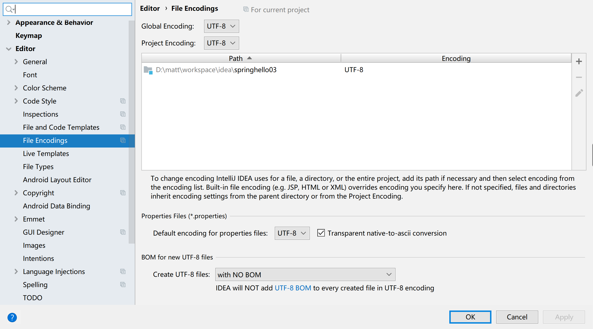


#### @Value获取值和@ConfigurationProperties获取值比较

|                      | @ConfigurationProperties | @Value     |
| -------------------- | ------------------------ | ---------- |
| 功能                 | 批量注入配置文件中的属性 | 一个个指定 |
| 松散绑定（松散语法） | 支持                     | 不支持     |
| SpEL                 | 不支持                   | 支持       |
| JSR303数据校验       | 支持                     | 不支持     |
| 复杂类型封装         | 支持//比如map类型        | 不支持     |


```java
@Component
@ConfigurationProperties(prefix = "person")
@Validated
public class Person {

    /**
     * <bean class="Person">
     *      <property name="lastName" value="字面量/${key}从环境变量、配置文件中获取值/#{SpEL}"></property>
     * <bean/>
     */

   //lastName必须是邮箱格式
    @Email
    //@Value("${person.last-name}")
    private String lastName;
    //@Value("#{11*2}")
    private Integer age;
    //@Value("true")
    private Boolean boss;

    private Date birth;
    private Map<String,Object> maps;
    private List<Object> lists;
    private Dog dog;
```

### @PropertySource

该类加载指定的配置文件

```java
@Component
@ConfigurationProperties(prefix = "cat")
@PropertySource(value = {"classpath:cat.properties"})
public class Cat {

    @Value(value = "#{cat.name}")
    private String name;
    private Integer age;

    public String getName() {
        return name;
    }

    public void setName(String name) {
        this.name = name;
    }

    public Integer getAge() {
        return age;
    }

    public void setAge(Integer age) {
        this.age = age;
    }

    @Override
    public String toString() {
        return "Cat{" +
                "name='" + name + '\'' +
                ", age=" + age +
                '}';
    }
}

```

### @ImportResource

导入指定的配置文件

```java
@Configuration
@ImportResource(locations = {"classpath:cat.properties"})
public class MyConfig {
}
```

### @Bean

```java
@Configuration
//@ImportResource(locations = {"classpath:cat.properties"})
public class MyConfig {
    
    /*
     * 功能描述: 容器中导入bean
     *  可以通过@Bean的value值指定bean的id,默认就是方法名
     * @Param: []
     * @Return: com.matt.study.springhello03.bean.Person
     * @Author: matt
     * @Date: 2020/12/12 22:44
     */
    @Bean
    public Person person() {
        return new Person();
    }
}
```

### 占位符

①${random.long}使用random函数

②使用已经定义的值${person.age}

```java
person.name=hello_${random.long}_${person.age}
person.age=11
```

### 多配置文件

#### profiles


使用spring.profiles.active=pro来决定激活哪个文件

#### yml多文档

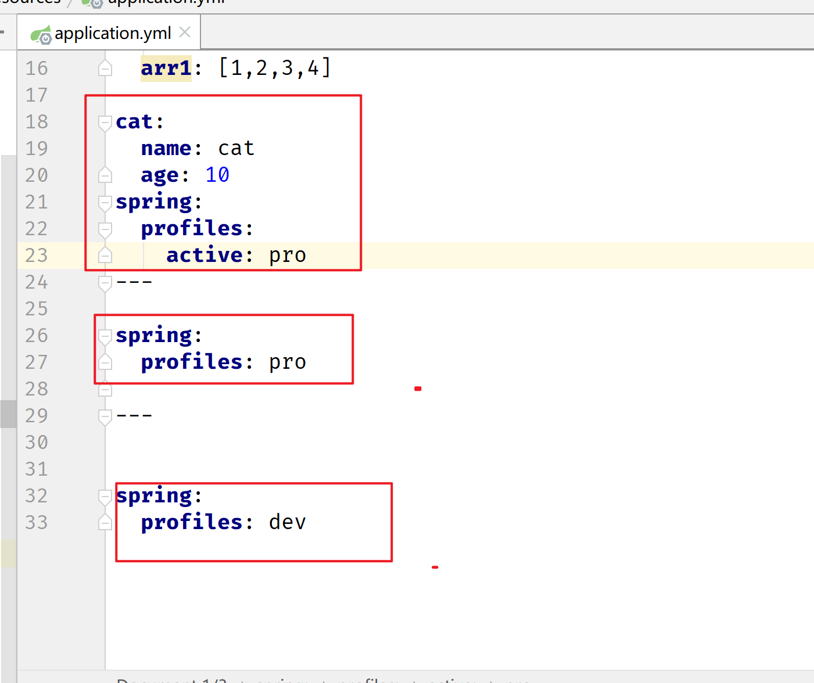


```java
spring:
  profiles:
    active: pro
---

spring:
  profiles: pro

---

spring:
  profiles: dev
```

#### 激活配置文件


1、在配置文件中指定  spring.profiles.active=dev

2、命令行：

```java
java -jar spring-boot-02-config-0.0.1-SNAPSHOT.jar --spring.profiles.active=dev
```

3、虚拟机参数；

```java
-Dspring.profiles.active=dev
```

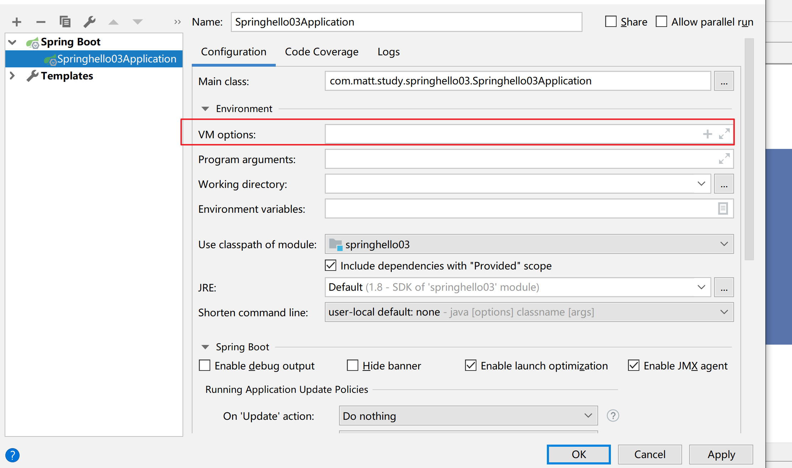		

#### 配置文件的加载位置

```java
./config  项目的config目录下
./   项目目录下
./classpath:/config/
./classpath

```

从上往下优先级有高到低


#### 加载顺序

命令行参数

```java
java -jar spring-boot-02-config-02-0.0.1-SNAPSHOT.jar --server.port=8087  --server.context-path=/abc

多个配置用空格分开； --配置项=值
```

==**由jar包外向jar包内进行寻找；**==

==**优先加载带profile**==

**jar包外部的application-{profile}.properties或application.yml(带spring.profile)配置文件**

**jar包内部的application-{profile}.properties或application.yml(带spring.profile)配置文件**


==**再来加载不带profile**==

**jar包外部的application.properties或application.yml(不带spring.profile)配置文件**

**jar包内部的application.properties或application.yml(不带spring.profile)配置文件**


@Configuration注解类上的@PropertySource

**从上往下优先级有高到低**


## 原理

### 自动配置原理

首先springboot的启动类有@SpringBootApplication注解,从该注解点进去

```java
@SpringBootApplication
public class Springhello03Application {

    public static void main(String[] args) {
        SpringApplication.run(Springhello03Application.class, args);
    }

}
```

因为是自动注入，所以我们可以从@EnableAutoConfiguration点进去

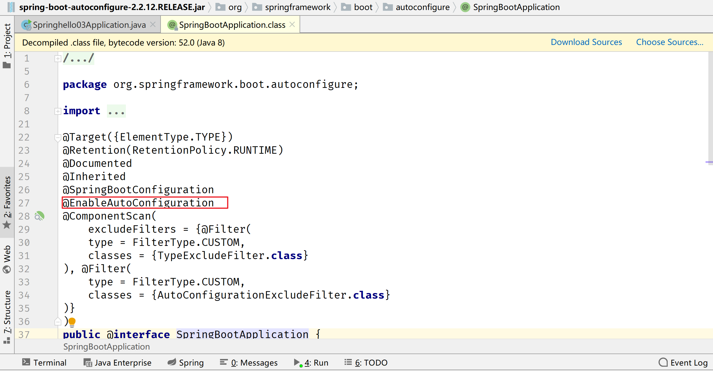


从下图中的@Import注解可知，它向容器中导入了AutoConfigurationImportSelector类，我们不妨可以观察该类


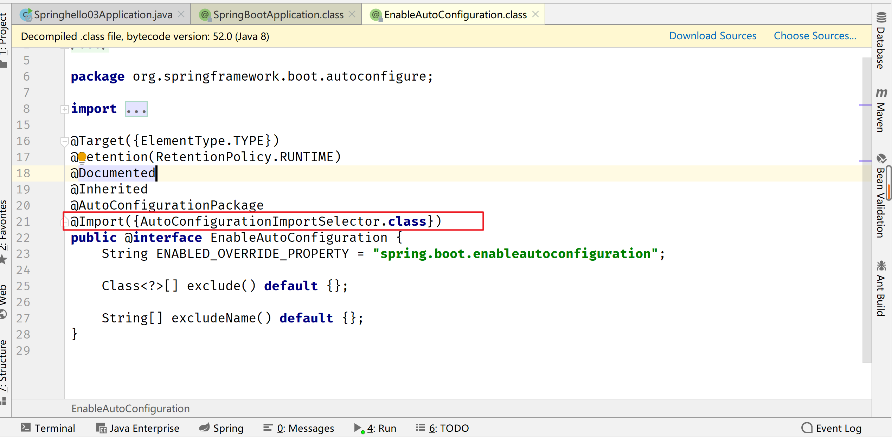


可以观察selectImports方法的这行代码，根据方法名我们可以猜测他是获取配置类

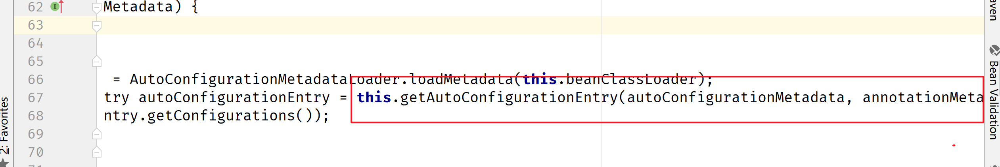


从上图的方法的实现点进去可以跳转到下图的方法，我们知道是从该红色部分获得的配置，不妨点进去

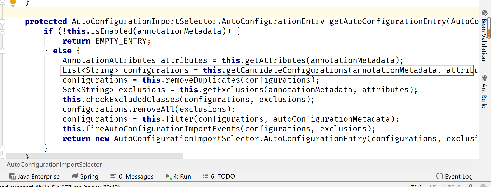

它的实现方法有俩个选择第一个即可

**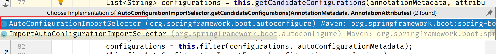**

得到下图，我们继续点进去到他的实现

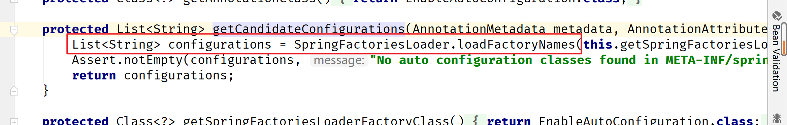


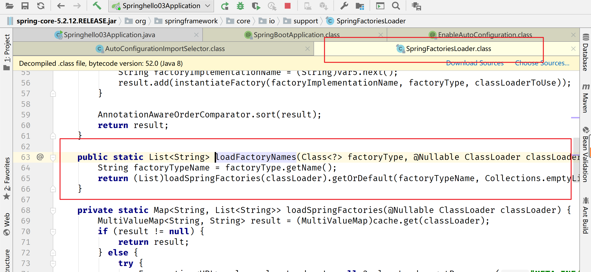


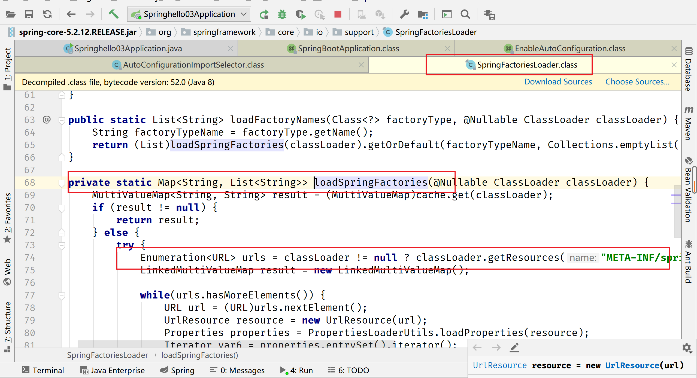


读取上图的方法我们知道读取META-INF/spring.factories并把它封装为Properties,从properties中获取到EnableAutoConfiguration.class类（类名）对应的值，然后把他们添加在容器中。


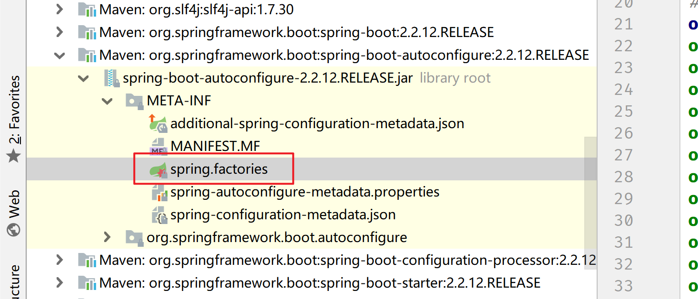


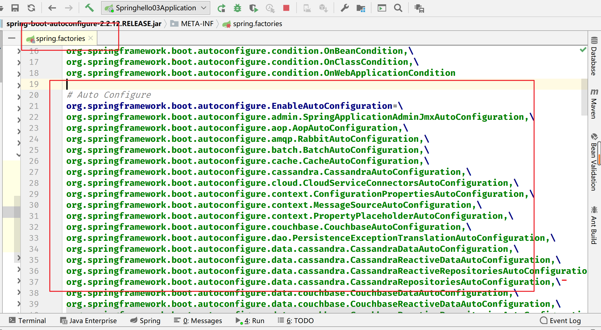


当然也不是所有配置类都加载到容器中，每一个配置类都会有@Conditional注解，只有满足某个条件才会加载到容器中。