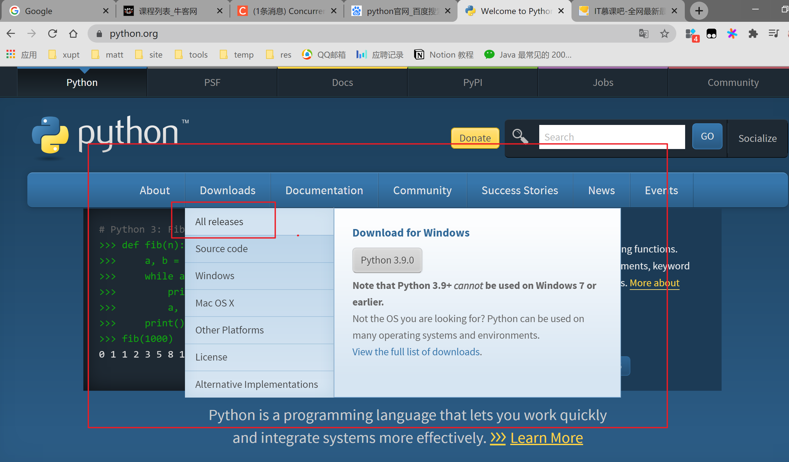
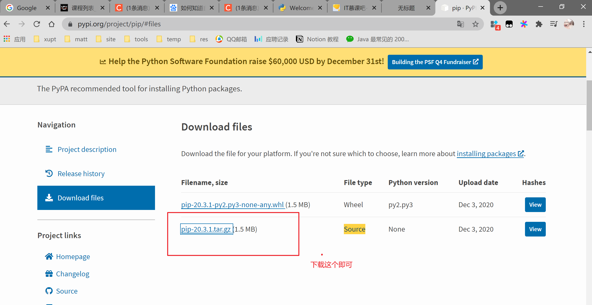

## 环境

### 安装环境

https://www.python.org/




选择对应版本点击即可2.7.17，最好选择32位的，因为它的兼容性更好

#### 配置Path

安装路径添加到path环境变量即可。


### 安装pip

**安装setuptools**

第一步：下载安装包（地址：https://pypi.io/packages/source/s/setuptools/setuptools-33.1.1.zip）

第二步：解压

第三步：CMD切换到该目录，切换的方法自己百度，运行命令”python setup.py install"

**安装pip**

第一步：下载pip压缩包（地址：https://pypi.org/project/pip/#files）

第二步：解压

第三步：CMD切换到该目录，运行命令”python setup.py install"



**pip环境变量配置**

这是你打开python的安装目录，发现Scripts的文件夹下就已经有了pip的文件，将此文件夹下的目录作为环境变量配置，再再在cmd下输入pip，完美完成！添加在path目录下


**检查**

在CMD输入pip,成功如下


### 安装requests

首先需要安装pip

2020.1205安装时由于挂vpn所以导致错误，之后关闭即解决问题。

```cmd
pip install requests
```

### VSCode

Pyright

Python

安装以上俩个插件