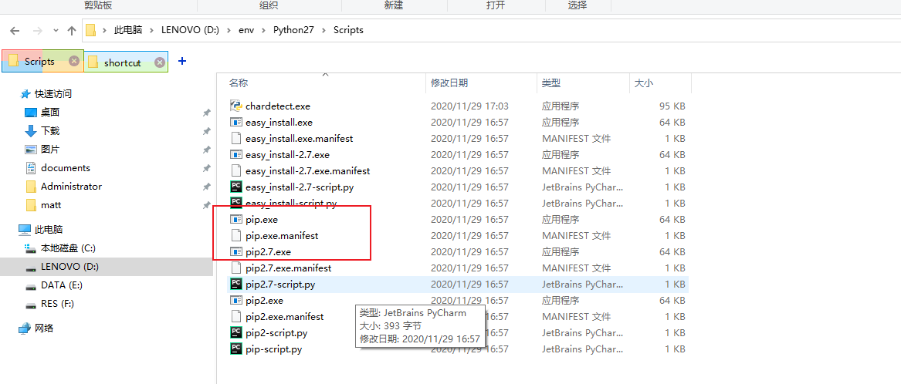

## 环境

### 安装pip

**安装setuptools**

第一步：下载安装包（地址：https://pypi.io/packages/source/s/setuptools/setuptools-33.1.1.zip）

第二步：解压

第三步：CMD切换到该目录，切换的方法自己百度，运行命令”python setup.py install"

**安装pip**

第一步：下载pip压缩包（地址：https://pypi.org/project/pip/#files）

第二步：解压

第三步：CMD切换到该目录，运行命令”python setup.py install"

**pip环境变量配置**

这是你打开python的安装目录，发现Scripts的文件夹下就已经有了pip的文件，将此文件夹下的目录作为环境变量配置，再再在cmd下输入pip，完美完成！添加在path目录下



**检查**

在CMD输入pip,成功如下


### 安装requests

首先需要安装pip

```cmd
pip install requests
```